# YOLOv3 in FFmpeg-4.3.1

## Introduction

I integrate YOLOv3 into ffplay so that it could dectect objects in videos.  
`Darknet.cpp` and `Darknet.h` come from [libtorch-yolov3](https://github.com/walktree/libtorch-yolov3). `cmdutils.c`, `cmdutils.h` and `ffplay.c` come from FFmpeg-4.3.1/fftools and I change `ffplay.c` to `ffplay.cpp`. This project is based on [myplay](https://github.com/hanjialeOK/myplay).

## Branches

- **master** - Use OpenCV to scale and normalize (from 0-255 to 0-1) and draw recangle.
- **filter** - Totally ffplay. OpenCV is removed.

## Figure Illustration

This figure shows how ffplay works. I put YOLOv3 into upload_texture().



This figure shows the conversion process in upload_texture().


## Requirements

- CMake >= 3.0
- GNU >= 5.4.0
- LibTorch >= 1.5.0
- SDL2 >= 2.0
- FFmpeg == 4.3.1 or 4.3.2
- OpenCV >= 3.0 (which is necessary in master, not filter)

## Installation

### OpenCV

Follow the [Installation in Linux](https://docs.opencv.org/3.4.13/d7/d9f/tutorial_linux_install.html). If you are going to use filter, skip.

### SDL2 & yasm

```c
sudo apt install libsdl2-dev
sudo apt install yasm
```

### FFmpeg-4.3.1

```c
wget http://ffmpeg.org/releases/ffmpeg-4.3.1.tar.gz
tar -zxf ffmpeg-4.3.1.tar.gz
cd ffmpeg-4.3.1
mkdir build && cd build
// if cpu
./../configure --prefix=/usr/local/ffmpeg --enable-shared
make
sudo make install

// set environment variables
vim ~/.bashrc
// add them to file
export PATH=/usr/local/ffmpeg/bin:$PATH
export LIBRARY_PATH=/usr/local/ffmpeg/lib:$LIBRARY_PATH
export LD_LIBRARY_PATH=/usr/local/ffmpeg/lib:$LD_LIBRARY_PATH
// source to make it work
source ~/.bashrc
```

### nvidia-460 + cuda-11.2

If you have a GPU, follow this [tutorial](https://blog.csdn.net/weixin_43742643/article/details/115355545).   
If not, skip.

### LibToch

```c
// if cpu
wget https://download.pytorch.org/libtorch/cpu/libtorch-shared-with-deps-1.7.1%2Bcpu.zip
// if gpu
wget https://download.pytorch.org/libtorch/cu110/libtorch-shared-with-deps-1.7.1%2Bcu110.zip
unzip libtorch-shared-with-deps-1.7.1+cu110.zip
export Torch_DIR=/path/to/libtorch
export LD_LIBRARY_PATH=/path/to/libtorch/lib:$LD_LIBRARY_PATH
```

if you want to download previous versions, click [here](https://blog.csdn.net/weixin_43742643/article/details/114156298).

### Clone this repo

```c
git clone git@github.com:hanjialeOK/YOLOv3-in-FFmpeg.git
// if you just need filter
git clone -b filter git@github.com:hanjialeOK/YOLOv3-in-FFmpeg.git
```

### Download weights

```c
cd YOLOv3-in-FFmpeg/models
wget https://pjreddie.com/media/files/yolov3.weights
wget https://pjreddie.com/media/files/yolov3-tiny.weights
```

### Configuration

Modify CMakeLists.txt according to your own condition.

- set `FFMPEG_SOURCE` path/to/ffmpeg-4.3.1

    ```c
    set(FFMPEG_SOURCE ~/ffmpeg-4.3.1)
    ```

- set `FFMPEG_BUILD` path/to/where/you/build/FFmpeg-4.3.1

    ```c
    set(FFMPEG_SOURCE ~/ffmpeg-4.3.1/build)
    ```

- if libtorch could not be found.

    ```c
    find_package(Torch REQUIRED PATHS path/to/your/libtorch)
    ```

## Compile & Run

```c
cd YOLOv3-in-FFmpeg
mkdir build && cd build
cmake ..
make
./myplay -v quiet ../videos/fpx.mp4
```
